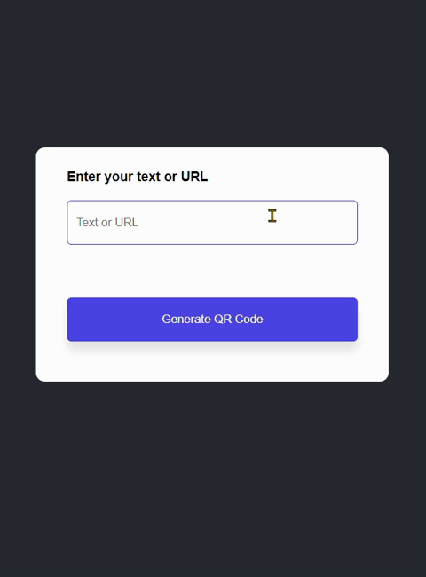

# QR Code Generator 📟

## Overview
The *QR Code Generator* is a simple web application that enables users to create QR codes for text or URLs. Users can input their desired text or URL, click the **Generate QR Code** button, and the application will display the corresponding QR code.

## Technologies Used 🚀
- **HTML**
- **CSS**
- **JavaScript**

## Usage 💻
1. **Input Text or URL:**
   - Enter your text or URL using the input box.
2. **Generate QR Code:**
   - Click the *Generate QR Code* button to create the QR code.
3. **View QR Code:**
   - The QR code image will be displayed below the input box.

## Live Demo 🌐
Live Demo : [QR Code Demo](https://qr-code-generator-ten-kappa.vercel.app/)

## Installation
No special installation is required for this project. Simply download the project files and open the `index.html` file in a web browser.

## API Information 🔗
This project utilizes the [QR Code Generator API](https://goqr.me/api/). The API allows dynamic QR code generation based on the user's input.

## Contributing 🤝
Feel free to use, modify, and contribute to the project! If you have any questions or feedback, you can reach me at nisagokdemir@gmail.com

## License
This project is licensed under the **MIT License**.
